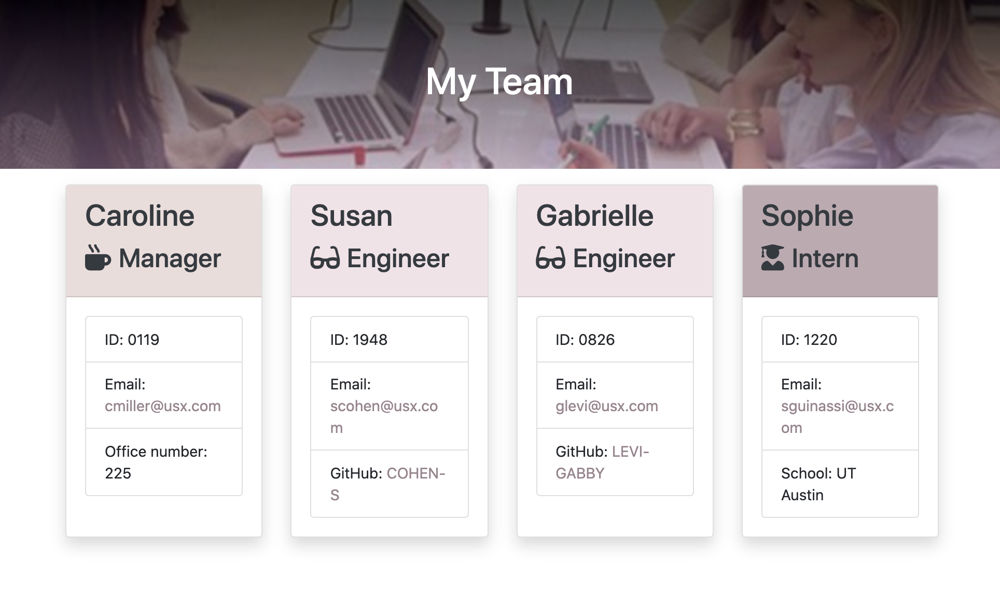
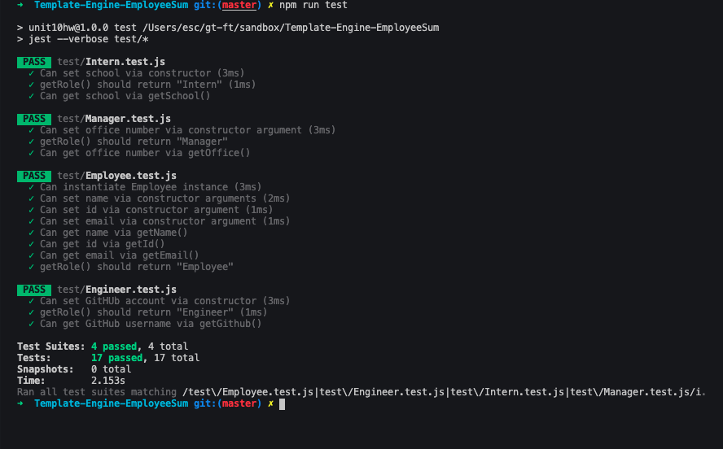
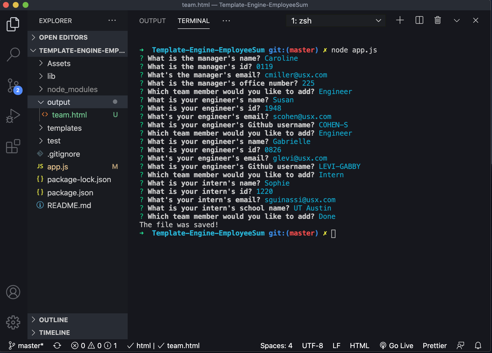

  ## **Unit 10 OOP Homework: Template Engine - Employee Summary**

  [](http://https://github.com/SIROG-E)  
  
  ## Description
  For this assignment, we built a Node CLI that takes in information about employees and generates an HTML webpage that displays summaries for each person. 

  A software engineering team generator command line application was built. 
  * This project prompts the user to build an engineering team. An engineering team consists of a manager, and any number of engineers and interns. 
  * This project generates a `team.html` page in the `output` directory, that displays a nicely formatted team roster, when the user has completed building the team,. Each team member displays: 
    - Name
    - Role
    - ID
    - Role-specific property (Office Number, GitHub profile link, or School)
  - All unit tests pass.
  
  ## Table of Contents
  * [Description](#description)
  * [Installation](#installation)
  * [Usage](#usage)
  * [Preview](#preview)
  * [Website](#website)
  * [License](#license)
  * [Contributing](#contributing)
  * [Test](#tests)
  * [Questions](#questions)
  
  ## Installation

  `Run:` 

  ```
  npm install
  ```
  `Run:` 
  ```
  npm run test
  ```

  ## Usage

  This command-line application generates a  Template Engine from a user's input. The application will be invoked with the following command: 

  ```
  node app.js
  ```

  

## Preview


 

 

 


### Websites

[Template-Engine-EmployeeSum](https://github.com/SIROG-E/Template-Engine-EmployeeSum) 


## License
  This project is licensed by:\
[](https://opensource.org/licenses/MIT) 

## Contributing
  

## Test
   

## Questions
  If you have any questions, contact SIROG-E at goris.evelyn@gmail.com
  
## Repository
  - [Project Repo](https://sirog-e.github.io/Good-README-Generator/)
  
  ## GitHub
  
  - Evelyn Goris
  - [GitHub Profile](https://github.com/SIROG-E)
  - <goris.evelyn@gmail.com>
  